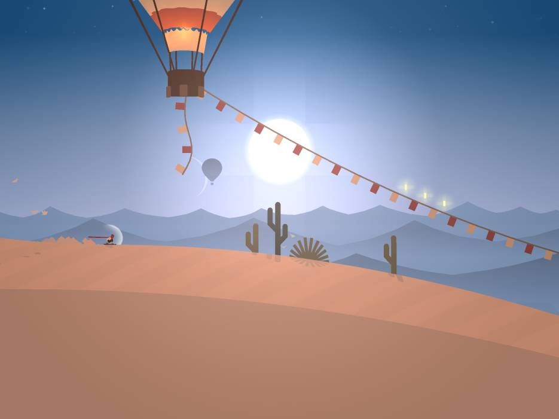
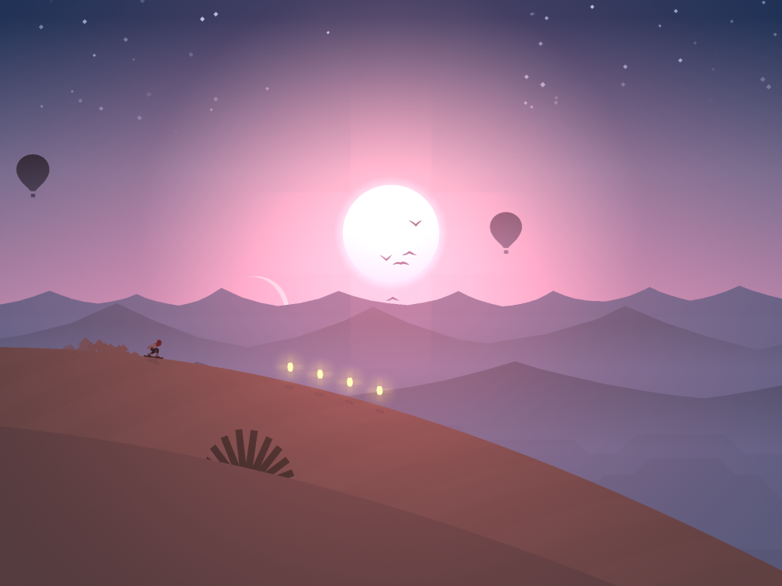
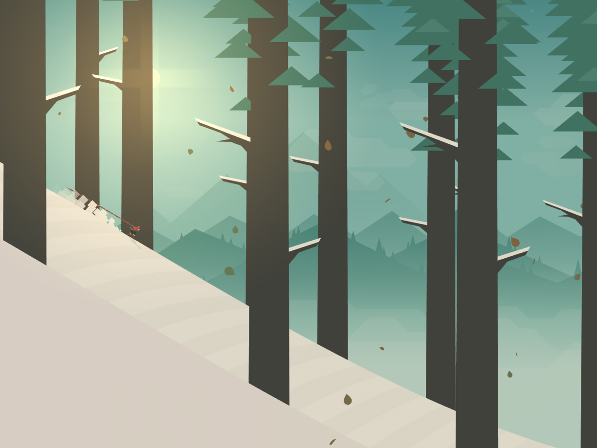

# 《Alto's Odyssey》

《Alto's Odyssey》是一款由Snowman开发的手机游戏，是继《Alto's Adventure》之后的续作。游戏于2018年2月发布，适用于iOS、Android和tvOS平台。

这款游戏被归类为无尽平台冒险游戏，玩家将控制主角阿尔托（Alto）或其他可解锁的角色，在美丽而神秘的沙漠环境中进行滑雪冒险。游戏的玩法非常简单，玩家只需点击屏幕来让角色跳跃、翻滚、飞翔和执行各种技巧，以躲避障碍物、收集金币和完成各种任务。

## 游戏玩法

《阿尔托的奥德赛》的玩法和前作大致相同，[玩家角色](https://zh.wikipedia.org/wiki/玩家角色)会在[随机生成](https://zh.wikipedia.org/wiki/程序化生成)的地形中自动地乘着[单板滑板](https://zh.wikipedia.org/wiki/單板滑雪)往右滑行，进行冒险。途中玩家可通过点击屏幕来跳跃，躲避石头或悬崖等会让玩家输掉的障碍物[[3\]](https://zh.wikipedia.org/zh-cn/奧托的奧德賽#cite_note-Pocket_Gamer_review-3)。跳跃时，玩家可按住屏幕操控角色在半空中进行特技[[4\]](https://zh.wikipedia.org/zh-cn/奧托的奧德賽#cite_note-TouchArcade_review-4)。不过，该游戏的背景从前作的雪地改至沙漠、峡谷和寺庙，且多了更多新设计，如莲花、热气球、藤蔓、攀岩、移动轨道和水流等[[5\]](https://zh.wikipedia.org/zh-cn/奧托的奧德賽#cite_note-:2-5)[[6\]](https://zh.wikipedia.org/zh-cn/奧托的奧德賽#cite_note-Verge:_Alto's_Odyssey-6)[[7\]](https://zh.wikipedia.org/zh-cn/奧托的奧德賽#cite_note-App_Store:_Alto's_Odyssey-7)。除此之外，《阿尔托的奥德赛》中仍延续前作的“拍照模式”，让玩家能在中途暂停游戏时调整画面进行拍照[[8\]](https://zh.wikipedia.org/zh-cn/奧托的奧德賽#cite_note-好奇心日報-8)。该游戏同前作一样附有“[禅](https://zh.wikipedia.org/wiki/禪)模式”，当中玩家可以无尽重生[[4\]](https://zh.wikipedia.org/zh-cn/奧托的奧德賽#cite_note-TouchArcade_review-4)。

## 游戏的特点包括：

### 风景如画的沙漠

《Alto's Odyssey》的游戏场景非常美丽，玩家将在日出、日落、星空和其他壮丽的背景下畅游。游戏中的天气和时间也会随着你的冒险而改变。

各种各样的任务

玩家可以完成各种任务来获取奖励，这有助于增加游戏的回放价值和挑战性。

音乐和声音效果：游戏中的音乐和声音效果相当出色，为玩家提供了一个令人沉浸的游戏体验。

### 

玩家可以通过游戏内的进度解锁不同的角色和装备，这些角色和装备具有不同的技能和特点，可以改变游戏的玩法。

Odyssey是一款简单但令人上瘾的游戏，其视觉效果和音乐使其成为一款令人愉悦的手机游戏。如果你喜欢无尽跑酷类型的游戏以及精美的游戏画面，那么这款游戏值得一试。

## 反响

《阿尔托的奥德赛》所获得的评价多为好评，并入围许多奖项。

《阿尔托的奥德赛》在推出后广受好评，评论汇总网站[Metacritic](https://zh.wikipedia.org/wiki/Metacritic)的分数达88%[[14\]](https://zh.wikipedia.org/zh-cn/奧托的奧德賽#cite_note-Metacritic-14)。《TouchArcade》的卡特·道特森（Carter Dotson）称赞该游戏的气氛“美丽动人”，沙漠背景“迷人至极”，且每一个小生物都有各自的特色，为每一次游戏提供了不同风味。他也对游戏中的天气变幻和昼夜更迭给予极高评价[[4\]](https://zh.wikipedia.org/zh-cn/奧托的奧德賽#cite_note-TouchArcade_review-4)。《[口袋玩家](https://zh.wikipedia.org/w/index.php?title=口袋玩家&action=edit&redlink=1)》的哈利·史莱特（Harry Slater）给予该游戏好评，表示“当你探索的这个世界是如此的生气蓬勃又美丽，你甚至会玩到忘记时间”[[3\]](https://zh.wikipedia.org/zh-cn/奧托的奧德賽#cite_note-Pocket_Gamer_review-3)。

